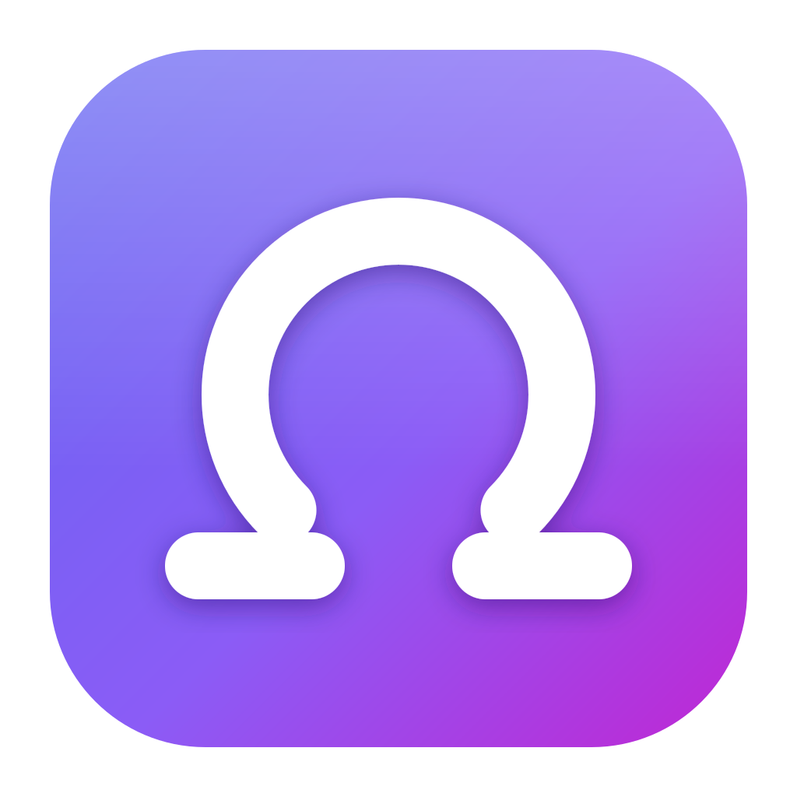

<p align="center">
  
</p>

<h1 align="center">Omegawhisper</h1>

<p align="center">
  Press one key anywhere on your Mac, speak, and the text is typed into whatever app you are in.
</p>

---

> ### On Linux? Use [hyperwhisper](https://github.com/hyperwhisper/app) instead.
>
> This is a fork of [**hyperwhisper**](https://github.com/hyperwhisper/app). Everything
> good here started there. The only reason this fork exists is to make dictation good on
> macOS, so all the work goes into the Mac side. The Linux code is inherited from
> upstream, left untouched, and **never tested here** — on Linux you would be running an
> out-of-date copy of the original with no benefit. Go to upstream.

## What it does

Omegawhisper sits in your menu bar. It has no Dock icon and no window in your way.
Press **F3**, speak, press **F3** again. A small spectrogram shows it is listening, and
the text is typed into the app you were already using. F3 is only the default — pick any
key in Settings.

Transcription runs three ways:

| Backend | Where it runs | Speed |
|---|---|---|
| **Local** (Whisper, Parakeet, Moonshine) | Your Mac, on the GPU. Offline, nothing leaves the machine | Transcribes after you stop |
| **Hyperwhisper server** | The upstream project's hosted service | Text appears while you speak |
| **Deepgram** | Deepgram, with your own API key | Text appears while you speak |

### Features

- One global shortcut, works in any app. **F3** by default, changeable in Settings
- Types into other apps with Unicode key events
- Local models run on the Mac GPU (Metal + CoreML)
- Spectrogram indicator window while you speak
- Recordings saved as WAV, and deletable from the menu bar
- Silence is never sent to the model, so it cannot invent text from a quiet room
- Dark theme

## Install (macOS)

There are no prebuilt macOS releases. You build it yourself. Tested on Apple Silicon.

### 1. Install the build tools

```sh
xcode-select --install                                          # C/C++ compiler and linker
curl --proto '=https' --tlsv1.2 -sSf https://sh.rustup.rs | sh  # Rust (not Homebrew's rust)
brew tap oven-sh/bun && brew install bun                        # Bun
brew install cmake                                              # builds whisper.cpp
```

CMake is not optional. Without it the build fails while compiling `whisper-rs-sys`.

### 2. Build

```sh
git clone https://github.com/webtemp/omegawhisper.git
cd omegawhisper
bun install
bun tauri build --bundles app
```

`bun install` is not optional either — the `tauri` command comes from a devDependency, so
without it step 4 fails with "command not found".

The first build compiles whisper.cpp and ONNX Runtime from source and takes a while.
Later builds are much faster.

Result: `src-tauri/target/release/bundle/macos/Omegawhisper.app`

### 3. Copy it to Applications

```sh
cp -R src-tauri/target/release/bundle/macos/Omegawhisper.app /Applications/
open /Applications/Omegawhisper.app
```

**Replacing an existing install?** Quit the app first and use `rsync`, not `rm -rf`.
macOS App Management protection blocks deleting an `.app` folder in `/Applications` and
can leave it half-deleted:

```sh
rsync -a --delete src-tauri/target/release/bundle/macos/Omegawhisper.app/ /Applications/Omegawhisper.app/
```

### 4. Grant permissions

- **Microphone** — macOS asks the first time you record.
- **Accessibility** — needed to type into other apps. Open
  `System Settings` → `Privacy & Security` → `Accessibility`, add
  `/Applications/Omegawhisper.app`, and switch it on.

These builds are unsigned, so **every rebuild throws the Accessibility grant away**.
After each build, reset it and add the app again:

```sh
tccutil reset Accessibility dev.omegawhisper
open "x-apple.systempreferences:com.apple.preference.security?Privacy_Accessibility"
```

### 5. Pick a backend

Open **Settings** from the menu-bar icon. To run offline, choose a local model and
download it there — models are 80 MB to 1.6 GB.

The microphone is always the system default input. The device list in Settings is Linux
code and does nothing on macOS; change the input in System Settings → Sound.

## Using it

Press **F3** to start, speak, press **F3** to stop. That is the whole app.

To use a different key, open **Settings** → **Dictation key** → **Change**, then press the
combination you want. If it is already taken by another app it says so and keeps the old
one, so you can never end up with no shortcut.

The menu-bar icon has:

| Item | What it does |
|---|---|
| Open window | Shows the main window: text, waveform, playback |
| Hide window | Puts it away again, back to menu bar only |
| Recordings → Open Folder | `~/Library/Application Support/omegawhisper/recordings` |
| Recordings → Delete Recordings | Deletes every saved WAV. Asks first |
| Show debug stats | Live microphone numbers, and a line of numbers under each result. Also in Settings |
| Settings | Dictation key, backend, model, trial key |
| Quit | Quits |

## Troubleshooting

**Nothing happens when I press the key.** Another app has taken it, or Accessibility is
off. Open the main window — startup problems appear there as a message. Pick a different
key in Settings → Dictation key.

**Text is transcribed but never typed.** Accessibility. If you rebuilt the app, the grant
is gone even though the checkbox still looks on: reset it (step 4).

**The app freezes for a second after I stop.** Expected with local models. They transcribe
after the recording ends, not during.

**Whisper writes text I never said.** Recordings with no speech in them are refused before
they reach the model, so this should not happen. If it does, the log line for that
dictation shows the loudness it measured.

**Anything else.** The log is at
`~/Library/Application Support/omegawhisper/omegawhisper.log`. Switch on **Show debug
stats**, in the menu bar or in Settings, to get live microphone numbers and a line of
numbers per dictation.

## Development

```sh
bun install
bun tauri dev     # dev server + app
bun run test      # Rust tests + frontend tests
bun run test:rust # Rust only
bun run test:web  # frontend only
bun run dev       # frontend only, port 1420
```

Regenerating the icons: `bun tauri icon logo.png`

```
src/                       React 19 frontend
  App.tsx                  main window: recording, text, waveform, playback
  components/indicator.tsx spectrogram window
  components/settings-page.tsx
src-tauri/src/
  lib.rs                   commands, recording threads, typing, tray, windows
  managers/model.rs        model list, download, delete
  managers/transcription.rs  loads a model, runs transcribe-rs
  audio/vad.rs             voice detection
```

See [AGENTS.md](./AGENTS.md) for how the pieces fit together.

**Tech stack:** React 19, TypeScript, Tailwind CSS 4, shadcn/ui, Rust, Tauri v2, cpal.

## Linux

<details>
<summary>Inherited from upstream and never tested here — expand only if you know what you are doing</summary>

Really, use [hyperwhisper](https://github.com/hyperwhisper/app). Nothing below has been
run since the fork.

### Requirements

- PipeWire or PulseAudio for audio capture
- `ydotool` (Wayland) or `xdotool` (X11) for auto-type

### Enabling auto-type

Make sure `/dev/uinput` is owned by the `root` user and the `input` group:

```sh
sudo tee /etc/udev/rules.d/99-uinput.rules << 'EOF'
KERNEL=="uinput", MODE="0660", GROUP="input", OPTIONS+="static_node=uinput"
EOF
sudo udevadm trigger --name-match=uinput
```

Create a `ydotoold` user service and enable it:

```sh
mkdir -p ~/.config/systemd/user/
cat > ~/.config/systemd/user/ydotoold.service << 'EOF'
[Unit]
Description=ydotoold daemon

[Service]
ExecStart=/usr/bin/ydotoold
Restart=always

[Install]
WantedBy=default.target
EOF

systemctl --user enable --now ydotoold.service
```

Add your user to the `input` group:

```sh
sudo usermod -aG input $USER
```

### Building

```sh
bun install
bun tauri build     # .deb, .rpm, .AppImage in src-tauri/target/release/bundle/
nix build           # NixOS
```

`nix-shell` or `flake.nix` gives a dev environment.

### Global shortcut

There is no built-in shortcut on Linux. Bind this to a key in your desktop environment:

```sh
omegawhisper transcribe toggle
```

Or over D-Bus:

```sh
dbus-send --session --type=method_call \
  --dest=dev.omegawhisper \
  /dev/omegawhisper \
  dev.omegawhisper.toggle_recording
```

</details>

## License

[GPLv3](./LICENSE)

- Copyright (C) 2026 Ameya Shenoy &lt;shenoy.ameya@gmail.com&gt;
- Copyright (C) 2026 Deyan Danailov &lt;webtemp@gmail.com&gt;

A modified fork of [hyperwhisper](https://github.com/hyperwhisper/app).
Modifications by Deyan Danailov, mainly macOS improvements.
